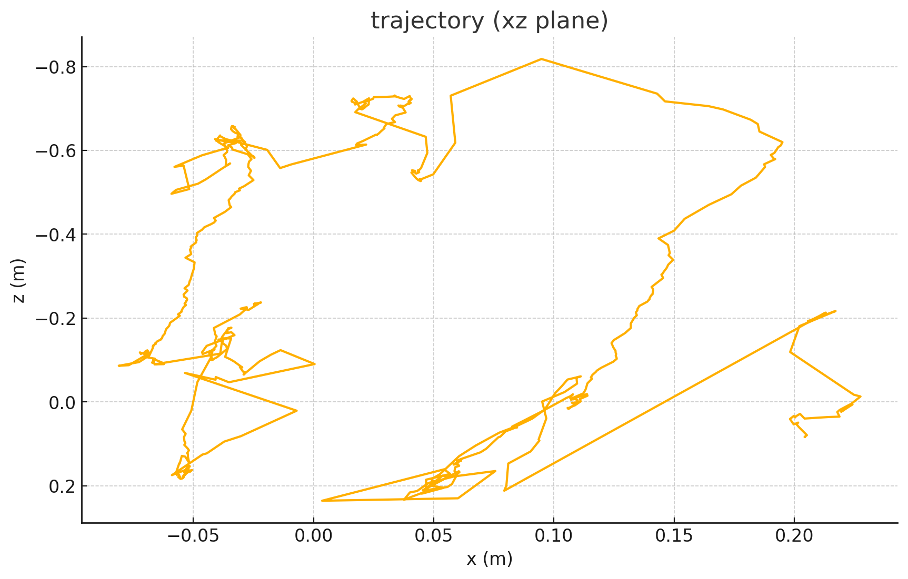

# depth-assisted monocular vo (local)

tiny perception stack that turns **one cheap camera** into continuous 6-dof pose on-device—no lidar, no ros, no gpu.
works both on pre-shot footage (recorded as any filetype) and on a live feed.

---

## hallway demo – live feed

<video src="output_trim.mov" width="640" loop autoplay muted></video>

<br/>



*20 s cam sweep -> walk around 2 m -> spin -> return. drift about 0.5 m over 7 m path — **solid in sub-optimal hallway lighting and handheld wobble**.*

---

## what’s inside
midas depth -> lucas-kanade flow -> depth-back-projection -> pnp-ransac -> tx ty tz rx ry rz


* **depth**: ViT-small @224², torch-mps
* **flow**: 500 Shi-Tomasi corners, LK pyr-lvl 2
* **pose**: solvePnPRansac

runs 20-25 fps on a fanless MacBook Air.

---

## scripts

| file | purpose |
|------|---------|
| **"live_feed.py"** | realtime webcam VO. overlays flow + per-frame translation, dumps **poses_live.csv** when you quit ( "esc"/"q" ). |
| **"preshot_handler.py"** | offline batch: "python preshot_handler.py my_clip.mp4" -> "my_clip_marked.mp4" + "poses.csv". handles any container (.mp4/.mov/.avi). |

---

## quick start

```bash
brew install ffmpeg # only needed for trimming/conv
pip install torch torchvision timm opencv-python numpy

# live demo
python live_feed.py

# offline demo
python preshot_handler.py hallway.mov
```

## why it matters
cheap navigation for indoor delivery / service robots – uses a phone-class camera.

metric scale from monocular depth, so planners work in meters.

apple-silicon friendly (torch-mps); same code cross-compiles to Jetson/Pi.


